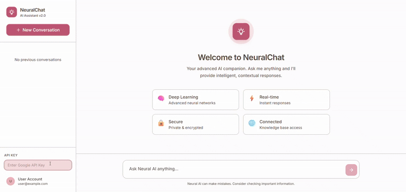

# NeuralChat - AI Assistant 🤖

NeuralChat is a modern, full-stack AI chat application built with **FastAPI** (Backend) and **React** (Frontend). It leverages Google's **Gemini Pro** model to provide intelligent, contextual responses in a beautiful, premium interface.

---

## 🎥 Demo



---

## 🚀 Key Features

- **Premium UI/UX**: A stunning "Rose & Sage" color palette with smooth animations and glassmorphism effects.
- **Intelligent Responses**: Powered by Google Gemini Pro for high-quality conversational AI.
- **Secure Key Management**: Users can provide their own API keys via the sidebar, ensuring privacy and security.
- **TypeScript Support**: Robust frontend implementation using TypeScript for type safety and better developer experience.
- **Markdown Rendering**: Support for code snippets, lists, and formatted text in chat messages.

---

## 🛠️ Project Structure

- `frontend/`: React + Tailwind CSS + TypeScript frontend.
- `backend/`: FastAPI + Google Generative AI backend.
- `gif/`: Contains project demonstration assets.

---

## ⚙️ Getting Started

### Prerequisites
- **Node.js**: 16.x or higher
- **Python**: 3.9+
- **Google AI API Key**: Get one at [Google AI Studio](https://aistudio.google.com/app/apikey).

### 1. Backend Setup
1. Navigate to the backend directory:
   ```bash
   cd backend
   ```
2. Create and activate a virtual environment:
   ```bash
   python -m venv venv
   # Windows:
   .\venv\Scripts\activate
   # Linux/Mac:
   source venv/bin/activate
   ```
3. Install dependencies:
   ```bash
   pip install -r requirements.txt
   ```
4. Run the server:
   ```bash
   uvicorn main:app --reload
   ```

### 2. Frontend Setup
1. Navigate to the frontend directory:
   ```bash
   cd frontend
   ```
2. Install dependencies:
   ```bash
   npm install
   ```
3. Start the development server:
   ```bash
   npm start
   ```

---

## 🔑 API Key Usage

NeuralChat is designed for security and privacy. **No API keys are stored on the server.**

1. Get your API key from [Google AI Studio](https://aistudio.google.com/app/apikey).
2. Open the NeuralChat web interface.
3. Paste your key into the **API Key** field in the sidebar.
4. Your key is passed only during active sessions to facilitate the chat.

---

## 🎨 Design System

NeuralChat uses a custom Tailwind CSS configuration based on the following palette:
- **Primary**: Rose (#C75F71)
- **Secondary**: Sage (#A2AE9D)
- **Muted**: Light Pink (#F0B8B8)
- **Foreground**: Dark Brown (#54463A)

